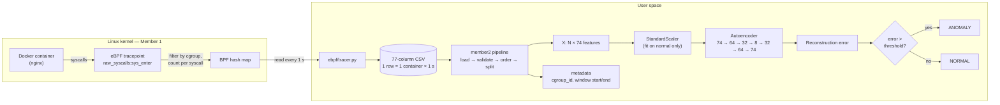

# Syscall Anomaly Detection for Docker Containers

Detects suspicious behaviour inside a running Docker container by watching the
system calls it makes. An eBPF program counts the container's syscalls inside
the kernel, one row per second. An autoencoder trained only on normal traffic
flags any second that looks unlike normal behaviour.

No attack signatures or labelled attack data are needed to train it. The model
learns what normal looks like, and anything it can't reconstruct well is
treated as an anomaly.

## Architecture



The system has three stages, one per team member:

1. **Collection (Member 1, `ebpf/`).** An eBPF program attached to the
   `raw_syscalls:sys_enter` tracepoint counts syscalls for one container,
   picked out by its cgroup ID. Counting happens in the kernel, so only one
   small vector crosses into user space each second, not every syscall event.
   The tracer turns the counts into one CSV row per 1-second window.
2. **Data preparation (Member 2, `member2/`).** Loads the CSV and checks it
   against the agreed contract. It then puts columns in a fixed order and
   separates the 3 metadata columns from the 74 model features. The output is
   a `float64` matrix `X` plus the matching metadata rows, which tie each
   prediction back to a container and a time window.
3. **Detection (Member 3, `person3_ml/`).** Scales the features and passes
   them through the autoencoder. The mean squared reconstruction error is
   compared against a threshold learned from normal traffic.

### Why these choices

- **In-kernel counting.** Sending every syscall event to user space is
  expensive for a busy container. Counting in a BPF map keeps the overhead to
  one increment per syscall.
- **Autoencoder, not a classifier.** Real attack data is scarce, and new
  attacks don't match old ones. An autoencoder needs only normal traffic to
  train, and it flags anything it hasn't seen before.
- **1-second windows.** Short enough to raise an alert while an attack is
  happening, and long enough to smooth out single-request noise.

## Feature vector

Each CSV row has 77 columns: 3 metadata columns and 74 features. The column
list lives in [`member2/schema.py`](member2/schema.py), and Naman's tracer
writes its header from the same list.

| Columns | Count | Meaning | In current data |
|---|---|---|---|
| `cgroup_id`, `window_start_ns`, `window_end_ns` | 3 | Which container and which second (Unix-epoch ns). Never fed to the model. | Real |
| `syscall_01_count` … `syscall_20_count` | 20 | Calls to each of 20 syscall families in the window | Real |
| `pair_01_count` … `pair_50_count` | 50 | Consecutive syscall pairs (bigrams) | Always 0: not implemented yet |
| `stat_01`, `stat_02` | 2 | Mean and std of time between syscalls (ns) | Always 0: not implemented yet |
| `stat_03` | 1 | Syscalls that returned an error | Always 0: not implemented yet |
| `stat_04` | 1 | Distinct syscall families seen in the window (0–20) | Real |

The 20 syscalls fall into two groups:

- **Normal-behaviour syscalls** give the model a baseline: `read`, `write`,
  `recvfrom`, `openat`, `close`, `mmap`, `munmap`, `epoll_wait`, `accept4`,
  `sendfile`.
- **Security-relevant syscalls** stay near zero normally and spike under
  attack: `execve`, `clone`, `connect`, `socket`, `setns`, `unshare`,
  `ptrace`, `fchmodat`, `fchownat`, `kill`.

See [`docs/VOCAB.md`](docs/VOCAB.md) for the full column-by-column definitions.

## Repository layout

```
ebpf/            eBPF tracer and syscall vocabulary (Member 1)
workload/        normal nginx traffic generator and simulated attacks
member2/         CSV contract, validation, feature matrix, evaluation labels (Member 2)
person3_ml/      autoencoder, training, detection, evaluation, plots (Member 3)
  models/        trained model, fitted scaler, threshold
  results/       training loss and reconstruction-error plots
data/            captured CSVs (normal.csv committed; other captures gitignored)
tests/           Member 2 test suite and a real-data sample fixture
docs/            contract, vocabulary, handoff and architecture notes
```

## Running it

### Requirements

- **Capture (`ebpf/`, `workload/`):** Linux x86_64 with cgroup v2, Docker,
  root access, and [BCC](https://github.com/iovisor/bcc) (`python3-bpfcc`).
  The syscall numbers in `ebpf/vocab.py` are x86_64-specific.
- **Pipeline and model:** Python 3.9+ on any OS.

```bash
pip install -r requirements-ml.txt
```

### 1. Capture normal traffic (Linux only)

```bash
docker run -d --name demo nginx
sudo python3 ebpf/tracer.py demo data/normal.csv      # Ctrl+C to stop
python3 workload/normal_traffic.py demo 600           # in a second terminal
```

### 2. Train the autoencoder

```bash
python3 -m person3_ml.train data/normal.csv
python3 -m person3_ml.plot_results
```

Training saves the model, scaler and threshold to `person3_ml/models/`. The
scaler and threshold are fitted on normal data only.

### 3. Detect anomalies in a capture

```bash
python3 -m person3_ml.detect data/normal.csv
```

This prints the reconstruction error for every window and labels each one
`NORMAL` or `ANOMALY`.

### 4. Evaluate against simulated attacks

Capture with the tracer running while `workload/normal_traffic.py` and
`workload/attack.sh` run together. `attack.sh` writes each attack's start and
end time to `data/attack_log.csv`. Then run:

```bash
python3 -m person3_ml.evaluate data/eval.csv data/attack_log.csv
```

A window is labelled as an attack if it overlaps any attack interval. The
script reports precision, recall, F1, false-positive rate and which attacks
were detected.

The simulated attacks are: reconnaissance, dropping and running a binary,
an outbound connection, a namespace-escape attempt, and a process-spawn storm.

### Using the pipeline from code

```python
from member2.pipeline import prepare_aggregated_csv, prepare_window
from person3_ml.detect import score_window, anomaly_threshold

# A whole capture
prepared = prepare_aggregated_csv("data/normal.csv")
prepared.X                 # (628, 74) float64
prepared.metadata_rows     # (cgroup_id, window_start_ns, window_end_ns) per row

# One live window, e.g. a row the tracer just wrote
x = prepare_window(row)    # row: dict of the 77 column names to values
if score_window(x) > anomaly_threshold():
    print("ALERT")
```

### Tests

```bash
python3 -m unittest discover -s tests -v
```

## Status

**Working:** the full path runs on real kernel data, from the eBPF tracer to
the trained model. The training set `data/normal.csv` has 628 windows from 10
minutes of nginx traffic.

**Not done yet:**

- The evaluation capture (`data/eval.csv`, `data/attack_log.csv`), and
  therefore the detection metrics.
- The live demo loop: tracer → `prepare_window` → `score_window` → alert.
- Syscall-pair counting and `stat_01`–`stat_03` (planned for the final review).
- The threshold is the 95th percentile of validation error, so about 5% of
  normal windows are flagged. The original plan was mean + 3 × std. This is
  under review.
- Renaming placeholder column names (`pair_37_count`, etc.) to readable names
  for the report.
- Measuring the tracer's overhead on the container.

**Known limitations:**

- One container at a time.
- x86_64 only.
- Simulated attacks run through `docker exec`, which adds syscalls of its own
  to every attack's signature.

## Team

| Member | Area | Code |
|---|---|---|
| Naman | eBPF collection, workloads, feature vocabulary | `ebpf/`, `workload/` |
| Krishita | CSV contract, validation, feature matrix, evaluation labels | `member2/`, `tests/` |
| Abhiram | Autoencoder, training, detection, evaluation | `person3_ml/` |

## Further documentation

- [`docs/VOCAB.md`](docs/VOCAB.md): what every feature column means
- [`docs/naman_krishita_csv_contract.md`](docs/naman_krishita_csv_contract.md):
  the CSV format between collection and preparation
- [`docs/member2_abhiram_handoff.md`](docs/member2_abhiram_handoff.md): the
  interface between preparation and the model
- [`docs/naman_handoff_2026-09-22.md`](docs/naman_handoff_2026-09-22.md):
  collection-layer status and notes on the real data
- [`docs/review2_intermediate_artifacts.md`](docs/review2_intermediate_artifacts.md):
  Review 2 artifacts
