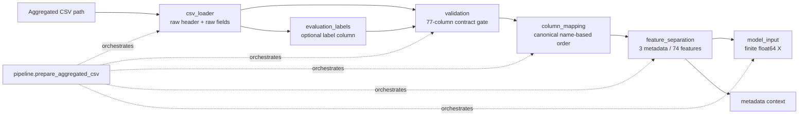

# Member 2 architecture and contribution record

## Role in the project

Member 2 (Krishita) owns the interface between Naman's already-aggregated
eBPF CSV and Abhiram's autoencoder input. This work makes the data handoff
reproducible, validates that the agreed CSV contract is respected, and keeps
model features separate from contextual metadata.

Member 2's input is **not** individual syscall events. Aggregation—including
syscall counts, pair counts, and window construction—happens in Naman's
eBPF/kernel side before CSV delivery.

## Internal architecture



The stable public seam is:

```python
from member2.pipeline import prepare_aggregated_csv

prepared = prepare_aggregated_csv("path/to/aggregated.csv")
```

It returns:

- `prepared.X`: NumPy `float64`, shape `(n_rows, 74)`, for Abhiram only.
- `prepared.metadata_rows`: one aligned tuple per `X` row containing
  `(cgroup_id, window_start_ns, window_end_ns)`.
- `prepared.feature_columns` and `prepared.metadata_columns`: the exact order
  used by the two outputs.

## Delivered components

| Component | Contribution |
|---|---|
| `member2/schema.py` | Authoritative 77-column schema: 3 metadata + 74 feature positions, with self-checks |
| `member2/mock_aggregated_csv.py` | Deterministic mock generator for already-aggregated contract-shaped rows |
| `member2/csv_loader.py` | Raw CSV reader that preserves header and field order for validation |
| `member2/validation.py` | Contract checks for columns, nulls, timestamps, counts, statistic numerics, cgroup consistency, and duplicate windows |
| `member2/column_mapping.py` | Reorders valid input by column name into the canonical schema order |
| `member2/feature_separation.py` | Keeps the 3 context fields separate from the 74 autoencoder fields |
| `member2/model_input.py` | Produces a finite `float64` 74-feature matrix |
| `member2/evaluation_labels.py` | Separates one caller-named optional evaluation label column from the normal data path |
| `member2/pipeline.py` | One CSV-path interface that composes the handoff stages |
| `tests/test_member2_pipeline.py` | Automated integration coverage for the current Member 2 path |

## Contract and schema decisions

The Naman-to-Krishita delivery rules are recorded in
[naman_krishita_csv_contract.md](naman_krishita_csv_contract.md). The most
important boundary conditions are:

- Exactly 77 normal-delivery columns, matched by case-sensitive name rather
  than incoming position
- One row per unique `(cgroup_id, window_start_ns)` pair
- 70 non-negative integer count features, with no blank/NaN feature values
- `window_end_ns > window_start_ns`
- Metadata remains out of the autoencoder input

The 74-position structure is settled, but the actual syscall/pair/statistic
names are currently placeholders. Once the team agrees the real vocabulary,
only the column lists in `member2/schema.py` need updating; the rest of this
pipeline consumes those lists rather than hardcoding feature names.

## Verification and Review 2 evidence

Run the Member 2 tests with:

```bash
python3 -m unittest discover -s tests -v
```

The Review 2 package and complete project diagram are in
[review2_intermediate_artifacts.md](review2_intermediate_artifacts.md). The
Member 3 handoff details are in
[member2_abhiram_handoff.md](member2_abhiram_handoff.md).

## Explicitly outside Member 2 scope

Member 2 does not modify or implement:

- Docker/container runtime setup, eBPF probes, BPF maps, kernel aggregation,
  or CSV emission (Member 1)
- Raw-event processing, count/bigram calculation, window aggregation, or
  timestamp reconstruction
- Autoencoder training, reconstruction error, thresholding, anomaly labels,
  performance metrics, or final results (Member 3)

## Remaining external dependencies

- The real syscall, syscall-pair, and statistic vocabulary
- The meaning/range of each statistic
- The final `cgroup_id` representation and timestamp clock/epoch convention
- Naman's real contract-compliant CSV
- Abhiram's model/evaluation implementation and dataset
